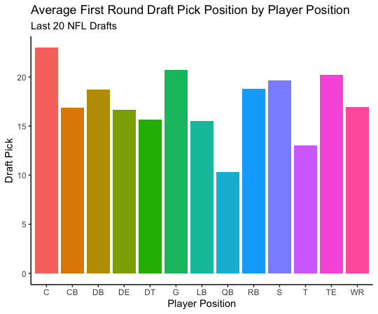
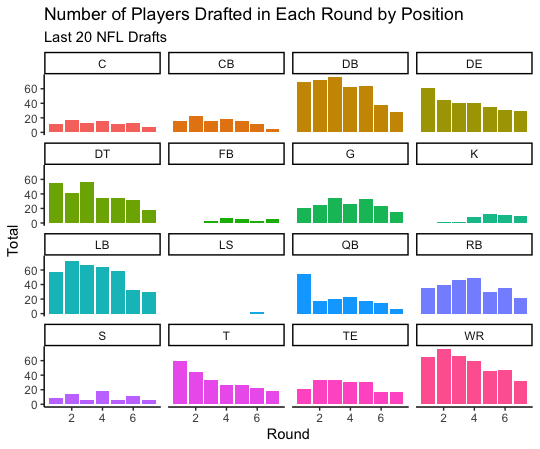
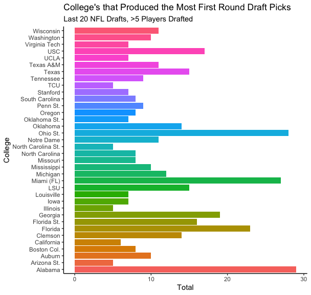
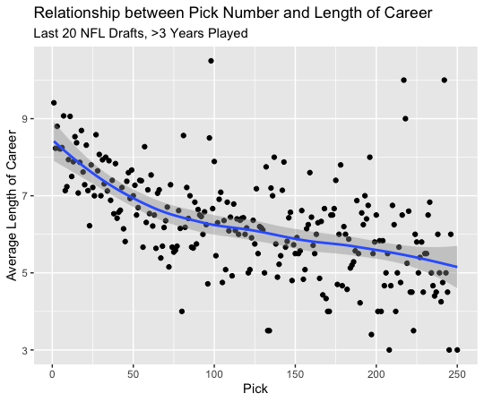
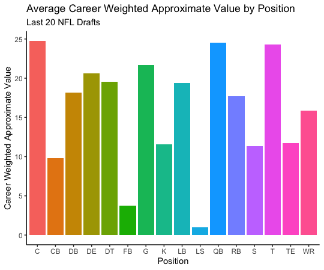
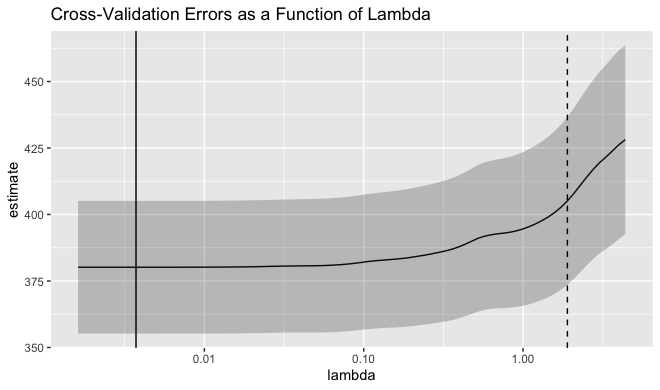
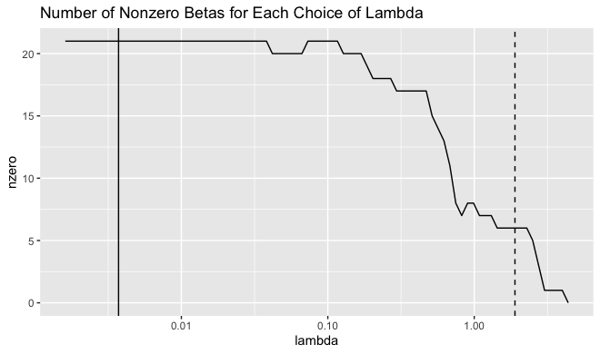
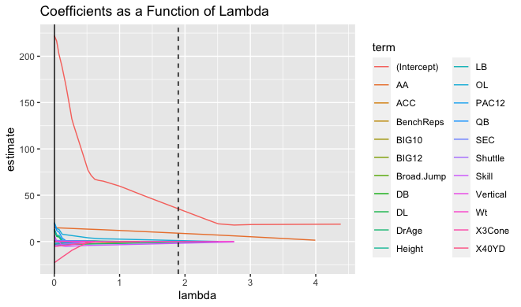
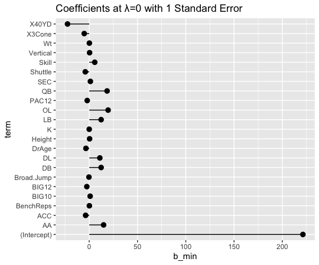
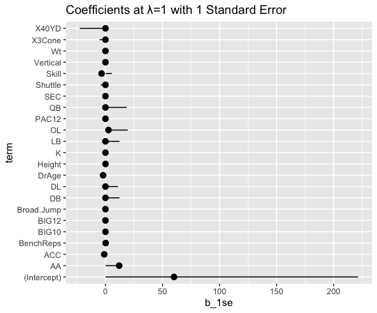

```{r setup, include=FALSE}
knitr::opts_chunk$set(echo = TRUE)
library(stargazer)
```


# Introduction
## Project Motivation

Team’s spend endless amounts of time and money preparing for the draft. In order to maximize their draft picks, teams must now use every resource available to them to gain an edge. Modern day sports are moving towards analytics whether fans like it or not. It’s about time every NFL team embraces this strategy and looks to the stats to determine a player’s potential. But the question still remains, does all this analyzing actually matter when determining how long and successful a player’s career will be? Or should teams just stick to the basics such as what school they played for or if they were an All-American in college? To analyze, this my model will look at the relationship between variables such as a player’s 40-yard dash time at the combine or what conference their college team played in and their effect on a player’s career weighted approximate value. 


<br>

## Research Questions

* Does a player’s college or performance at the NFL combine affect their long term success in the league?
* Which college teams produce:
  + the most first round picks?
  + the longest careers at each position?
  + the most successful careers at each position?
* What is the average wAV at each pick?
* What is the average length of career at each pick?
* What player position has the lowest/highest average draft position in the first round?
* How many players have been drafted in each round by position?
* Do college All-Americans have longer/more successful careers?


<br>

## Modeling Technique

Lasso Regression: Least Absolute Shrinkage and Selection Operator
Shrinkage is where data values are shrunk towards a central point, like the mean. The lasso procedure encourages simple, sparse models (i.e. models with fewer parameters). This particular type of regression is well-suited for models showing high levels of muticollinearity or when you want to automate certain parts of model selection, like variable selection/parameter elimination.


<br>


# Data

## Data Collection

For my analysis, I collected all of my data for the last 20 NFL drafts from Sports Reference. Sports Reference is a verified sports database that collects data on the four major sports (NFL, NBA, NHL, MLB).

## Data Cleaning

When cleaning the data I relied heavily on R and excel. I used many of the functions from the dplyr package in R to manipulate the data and remove any unwanted variables or duplicate observations. I noticed many NA and missing variables in the combine data which drove me towards using the lasso regression.

## NFL Draft Data


```{r}

stargazer(Malachy2022_04_24, type = "text", title="Descriptive statistics", digits=1, out="NFLSumStats.txt")
```


<br>


# Conceptual Framework

## Exploratory Visualizations

{width=40%}

In this graph I looked at the average first round pick by position. You can see that quarterbacks have the lowest average first round pick, followed by offensive tackles. This means that on average, quarterbacks and tackles have been drafted the highest in the first round. This makes absolutely perfect sense as quarterbacks are the most valuable position in all of football. Offensive tackles have also become one of the most important and expensive positions as they are the last line of defense to a quarterback and protect a quarterback's blindside. We see that positions like Center and Guard have the highest average position. Both of these positions are viewed as interchangeable which could be a reason why many teams don’t value drafting these players as much because they can plug in other players at these positions much easier.


{width=40%}
Here is another look at player positions and how many have been drafted in each round over the last 20 drafts. We can see again that most quarterbacks tend to go in the first round and then drop off. Positions like wide receiver and defensive back who matchup against each other on the field have similar trends over the rounds. Running Backs have begun to go in rounds 3 and 4 more often as teams have began to realize that running backs have short careers and that are much more replaceable than other positions in the sport.


{width=40%}
In this graph I examined the college teams with the most first round draft picks in the last 20 NFL drafts. The big name schools stood out like Alabama and Ohio State, but what surprised me was how many the University of Miami had. While they had excellent teams in the 1980s, 90s and early 2000s, their team has been pretty irrelevant in the college football world in terms of winning the last two decades. I would be curious to see how many of their first round draft picks were from those early 2000s teams and how many have come in the past decade.


{width=40%}
The graph above shows the relationship between pick number and the average length of a player’s career at that pick position. The linear relationship shows a steady decreasing trend pick pick position and average length of career which matches what I thought going in. What stood out were the outliers around pick 100, 220 and 240. Each of these picks had an average career length of 9.5 or higher. That’s even higher than the average career length of the first overall pick. It’s quite strange for these averages to be this high as teams would have to consistently hit on these picks and these players would have to avoid any career ending injuries to remain in the league for that long.


{width=40%}
This final graph displays the average career weighted approximate value by position for the last 20 years. Career weighted approximate value, or wAV, is a measurement of how good a player performed over the course of his career. We can see here that centers actually have the highest wAV followed by quarterbacks and tackles. This is extremely ironic as centers had the highest average first round draft position out of all the player positions, while quarterbacks and tackles had the lowest. This goes to show that it doesn’t matter where you are drafted, anyone can be great as long as they put in time and effort.


<br>


# Model

## Lasso Linear Regression Analysis
As mentioned earlier, I relied on lasso linear regression modeling to analyze my data. A lasso regressions can be extremely helpful when dealing with missing values. My dataset contained large amounts of missing values making it the perfect linear regression model for my analysis. As previously mentioned, the model uses a shrinkage technique that penalizes the betas as lambda increases. The NA or missing values are used as the 0 value parameter. As λ increases, bias increases and variance decreases. I also used cross-validation to find error estimates in my modeling. 


## Career Weighted Approximate Value Lasso Regression

`$$wAV_{i} = \beta_{0} + \beta_{1} * DrAge_{i} + \beta_{2} * Height_{i} + \beta_{3} * Wt_{i} +
\beta_{4} * X40YD_{i} + \beta_{5} * Vertical_{i} + \beta_{6} * BenchReps_{i} + \beta_{7} * Broad.Jump_{i} +
\beta_{8} * X3Cone_{i} + \beta_{9} * Shuttle_{i} + \beta_{10} * SEC_{i} + \beta_{11} * BIG10_{i} + 
\beta_{12} * BIG12_{i} + \beta_{13} * PAC12_{i} + \beta_{14} * ACC_{i} + \beta_{15} * AA_{i} + 
\beta_{16} * QB_{i} + \beta_{17} * Skill_{i} + \beta_{18} * OL_{i} + \beta_{20} * DL_{i} + \beta_{21} * LB_{i} + 
\beta_{22} * DB_{i} + \beta_{23} * K_{i} + \epsilon_{i}$$`


Where:

ϵt=Error Term


## Description NFL Player Variables

Rnd -- Round selected in draft

Pick -- Overall Selection in Draft

Pos -- Position

DrAge -- Age the player was as of the start of the season (9/1) in the year he was drafted

From -- First Year in the NFL

To -- Last Year in the NFL

wAV -- Weighted Career Approximate Value. The career AV is computed by summing 100 percent of the AV of his best season, 
95 percent of the AV of his next-best season, 90 percent of the AV of his third-best season, and so on

Height -- Height (ft-inches)

Wt -- Weight in Pounds

40YD -- Forty yard dash time

Vertical -- Vertical jump height, in inches

BenchReps -- 225 lb bench press reps

Broad Jump -- Broad jump distance, in inches

3Cone -- Three cone drill time

Shuttle -- 20 yard shuttle time

SEC -- dummy for SEC

BIG10 -- dummy for Big 10

BIG12 -- dummy for Big 12

PAC12 -- dummy for PAC 12

ACC -- dummy for ACC

Position -- dummy for player position

AA -- dummy for All-Americans

QB -- dummy for quarterbacks

Skill -- dummy for skill positions

OL -- dummy for offensive lineman

DL -- dummy for defensive lineman

LB -- dummy for linebackers

DB -- dummy for defensive backs

K -- dummy for kickers


<br>


# Results

```{r}
stargazer(reg1, type = "text", title="Descriptive statistics", digits=1, out="RegressionSumStats.txt")
```


{width=50%}
As lambda increases the number of CV errors increases showing that at a value of λ=1, the predictive error estimate is about 405-406.


{width=40%}
We see here that at λ=0 we have 22 independent variables. As λ increases it penalizes the betas as mentioned earlier. When it reaches the final λ value of 1, there are only 6 remaining variables whose betas are nonzero.


{width=50%}
Example of beta estimates as a function of λ.


{width=40%}
Coefficient values at λ=0, shows the value before being penalized.


{width=40%}
Coefficient values at λ=1, after being penalized.


<br>


# Discussion

After examining the results there are 6 variables that “survived” the penalization of λ. These variables are Draft age, Weight, Bench reps, All-American, Skill, and Offensive line. While I expected college conferences such as the SEC and BIG10 to have a significant statistical impact on a player’s success in the league, the model proved otherwise. The variable for All-American had the biggest impact which was no real surprise to me. If you are a good football player in college it is likely that you will continue to do well in the pros. What I noticed was that combine data showed no significant impact on a player’s success in the NFL. There may be something that I am missing in my regression analysis for why I am getting these results. This could be examined in further research given more time. However, if an NFL front office was to utilize the information from this current model, they should begin placing less emphasis on what school a player went to or how they performed at the combine, and instead place more value on players who were selected to be All-Americans in college as they tend to have a higher average career wAV.


<br>


# Conclusion

Overall this project was a great a learning experience for me as I prepare to enter the real work force in the world of data analytics. While it was difficult to work on the project by myself at times, I did benefit from the help of my professors in the Economics department. Professor Kirk Anne of RIT met with me weekly over zoom to guide me through the project and assist in any of the data collection process. I also met with my econometrics Professor Christopher Analla who is highly knowledgeable in the field of sports economics. 

I faced many challenges in the data collection process as a lot of the data I wanted to use was not available to me. Many times I was forced to change directions or alter my path slightly to obtain my goals due to the lack of information. Professor Anne pointed out that this was an important lesson to learn early on in our data analytics or data science careers because most of the time you have little to no guidance in what your responsibilities are. Going forward I plan to continue working on my research into the summer as I begin the job search. I hope to find more data on player's college stats or other potential metrics/variables that could be strong indicators of success. 


