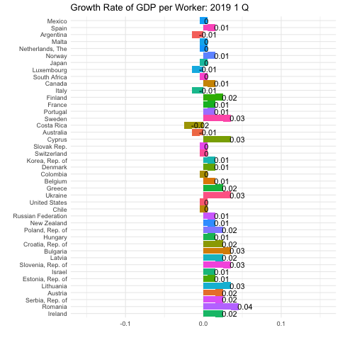

# Question 1

```{r echo=FALSE}
imf_growth <- read.csv(url('https://bcdanl.github.io/data/imf_growth_quarterly.csv'))

imf_growth <- imf_growth %>% mutate(gy = round(gy, digits = 2))

p <- ggplot(imf_growth, aes(x = reorder(country, -gy), y = gy, fill = country)) +
  geom_col() + coord_flip() + geom_tile() + geom_text(aes(label=as.character(gy), hjust = -0.2)) +
  transition_states(qt, transition_length = 1) + guides(fill = "none") + 
  labs(title = "Growth Rate of GDP per Worker: {closest_state}", x = "", y= "") + theme_minimal() + theme(legend.position = "none")

p
```



# Question 2

```{r echo=FALSE}
library(socviz)
library(plotly)

county_map <- county_map

climate_opinion <- climate_opinion %>% filter(belief == "human")

climate_opinion <- climate_opinion %>% mutate(id = as.numeric(id))
county_map <- county_map %>% mutate(id = as.numeric(id))

climate_opinion <- left_join(climate_opinion, county_map, by = 'id')

g <- ggplot(climate_opinion, aes(long, lat, fill = perc, group = group, text = GeoName))  + 
      geom_polygon(color = "gray70", size = 0.05) + 
        coord_equal()
g

g2 <- g + scale_fill_gradient2(
    low = "#2E74C0",  
    mid = "white",  
    high = "#CB454A",  
    na.value = "grey50",
    midpoint = 50)

g2

ggly <- ggplotly(g2)

ggly
```


